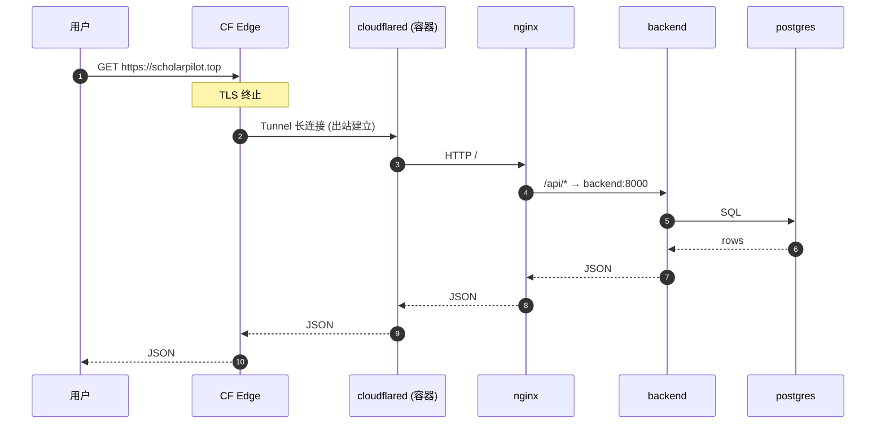
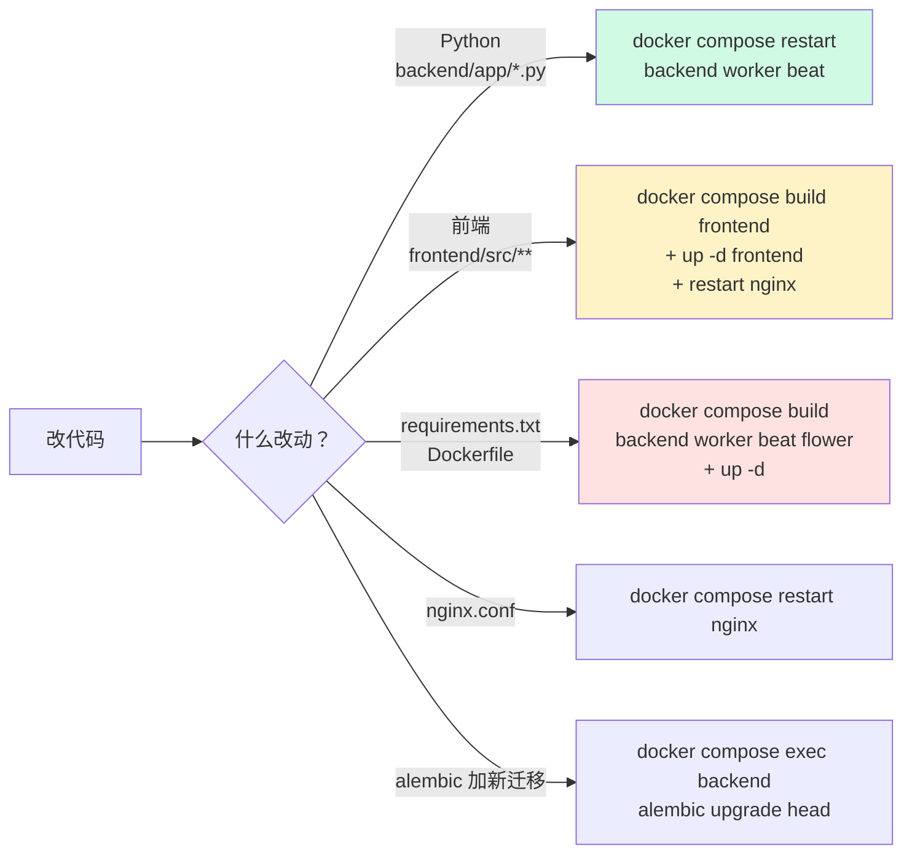

# 01 · 系统全景（30,000 英尺视角）

> 9 个 docker 服务怎么协作？流量怎么进来？数据存哪？

---

## 1. 容器架构

```mermaid
flowchart TB
    subgraph external["🌐 外部世界"]
        UU["用户浏览器"]
        CFE["Cloudflare Edge"]
    end

    subgraph host["🖥️ Cloud VPS / 本地"]
        subgraph net["docker compose network"]
            CFD["cloudflared<br/>(profile: prod)<br/>主动 outbound 长连"]
            NG["nginx:1.25<br/>:80 / :443"]
            FE["frontend<br/>(Vue3 dist)<br/>:80"]
            DT["devtools<br/>(Vue3 dist)<br/>:3001 → :80"]
            BE["backend<br/>FastAPI uvicorn<br/>:8000"]
            WK["worker<br/>celery -Q default,fulltext"]
            BT["beat<br/>celery scheduler"]
            FL["flower<br/>:5555"]
            PG[("postgres<br/>pgvector/pg16")]
            RD[("redis:7-alpine")]
        end
    end

    UU -->|HTTPS scholarpilot.top| CFE
    CFE -->|Tunnel| CFD
    CFD --> NG
    UU -.localhost.-> NG
    NG -->|/api/*| BE
    NG -->|/| FE
    NG -.devtools.scholarpilot.top.-> DT

    BE <-->|asyncpg| PG
    WK <-->|asyncpg| PG
    BE <-->|asyncio| RD
    WK <-->|asyncio| RD
    BT -.schedule.-> WK
    FL -.monitor.-> WK
    BE -->|dispatch task| RD
    RD --> WK

    style CFD fill:#fef3c7,stroke:#d97706
    style NG fill:#dbeafe,stroke:#2563eb
    style BE fill:#d1fae5,stroke:#059669
    style WK fill:#d1fae5,stroke:#059669
    style PG fill:#fce7f3,stroke:#db2777
    style RD fill:#fce7f3,stroke:#db2777
```

---

## 2. 服务清单

| 服务 | 镜像 | 角色 | 暴露 | volume | 备注 |
|---|---|---|---|---|---|
| **postgres** | `pgvector/pgvector:pg16` | 主库（项目/轮次/文档/反馈/记忆）| `:5432` 内部 | `pgdata` | DB 名 `urip` |
| **redis** | `redis:7-alpine` | Celery 队列 + LLM 配置缓存 + SSE pub/sub + Answer Now 中断标志 | `:6379` 内部 | `redisdata` | |
| **backend** | 自构建 | FastAPI · 24 个 router | `:8000` 内部 | **`./backend/app:/app/app` 挂载**（改代码 restart 即生效）| 启动跑 alembic upgrade |
| **worker** | 同 backend | Celery worker（搜索 + PDF 全文）| 内部 | 同 backend | `-c 8` 并发 8 |
| **beat** | 同 backend | Celery 定时调度（每日推送）| 内部 | 同 backend | |
| **flower** | 同 backend | Celery 监控面板 | `:5555` 公网 | — | |
| **frontend** | 自构建（Vue3 dist + nginx）| 主前端 | `:80` 内部 | **无 volume，必须 rebuild** | |
| **devtools** | 自构建（Vue3 dist + nginx）| 运维面板（日志可视化）| `:3001` 公网 | 无 volume | 受 Cloudflare Access 邮件验证保护 |
| **nginx** | `nginx:1.25-alpine` | 反代 + TLS | `:80 :443` 公网 | `nginx/nginx.conf` ro | 接 backend / frontend / devtools |
| **cloudflared** | `cloudflare/cloudflared:latest` | Tunnel 客户端（生产 only）| 主动 outbound | — | `profile: prod` 控制启停 |

---

## 3. 流量路径

### 3.1 生产（HTTPS via Cloudflare Tunnel）



**关键点**：
- 源站**入站全关**（阿里云防火墙禁用 80/443/全 TCP）
- cloudflared 是**主动出站**长连，规避了"未备案 → 阿里云骨干网 403 / CF 回源 525"两个老坑
- 见 CLAUDE.md「HTTPS / 安全」章节

### 3.2 本地开发

```
浏览器 localhost → nginx:80 → 同上 (无 cloudflared)
```

`docker-compose.yml` 里 `cloudflared` 服务有 `profiles: [prod]`，本地默认不启动，避免无 token 时 restart loop。

---

## 4. 改代码 → 生效路径



**为什么前端必须 rebuild？** Frontend 容器内是已构建好的 dist 文件（`Dockerfile` multi-stage 把 vite build 产物烤进去），没有 volume 挂载源码，源码改了不 rebuild 就看不到。

**为什么后端 restart 就行？** `docker-compose.yml:65` 把 `./backend/app` mount 到 `/app/app`，改 .py 立刻在容器里可见，但 uvicorn 进程还是旧的，restart 让它重新 import。

---

## 5. 数据持久化

| 数据 | 存哪 | 生命周期 |
|---|---|---|
| 用户 / 项目 / 轮次 / 文档 | postgres `urip` 库 | 持久 |
| 双层 markdown 记忆（用户 + 项目）| postgres `user_memory` / `project_memory` 表 | 持久 |
| 知识图谱（节点+边）| postgres + `data/knowledge_graphs/*.json` | 持久 |
| PDF 全文（Highwire / 反爬下载）| `data/pdfs/` (host 挂载到容器 `/app/data/pdfs`)| 持久 |
| LLM 配置 | postgres + Redis 60s TTL 缓存（`llm:config`）| 持久 |
| Celery 任务队列 | redis | 任务完成消失 |
| SSE 事件 | redis pub/sub | 实时一次性 |
| Answer Now 中断标志 | redis 短 TTL key | 单轮 |
| 本地知识库 (4.7M 文献元数据 + FTS5 索引) | `data/knowledge_base/` (DuckDB + SQLite)，**ro 挂载** | 准静态（手动 ETL 更新）|

`./data/` 目录的所有挂载在 `docker-compose.yml:70-77`，host 路径在 README 项目根。

---

## 6. 安全姿态

| 维度 | 现状 |
|---|---|
| 公网暴露 | nginx 80/443（本地）/ Tunnel only（生产）+ flower 5555 + devtools 3001 |
| TLS | Cloudflare 终止；源站不再要证书 |
| 认证 | JWT（`access_token`），`backend/app/api/auth.py`，invitation_code 注册（管理员发码）|
| Devtools 双层防护 | Cloudflare Access 邮件验证 → 进入后再看 `is_admin` |
| 秘密 | `.env` 不入库（`.gitignore`）；BigQuery `secrets/*.json` 容器只读挂载 |
| CORS | `settings.cors_allowed_origins` 逗号分隔白名单，空值降级 `["*"] + credentials=False` |
| Proxy headers | uvicorn `--proxy-headers --forwarded-allow-ips='*'`，FastAPI 拿 `request.url.scheme = "https"` |

---

## 7. 关键依赖一眼看（backend）

```
FastAPI 0.115     ──── Web framework
SQLAlchemy 2.0    ──── ORM (async, AsyncSession)
asyncpg 0.29      ──── PostgreSQL driver
Celery 5.4        ──── Task queue
Redis 5.1         ──── 队列/缓存/SSE
httpx 0.27        ──── 多源 HTTP 检索（共享 AsyncClient + 分层重试）
Playwright 1.47   ──── 反爬 PDF 下载兜底（Lens.org / MDPI 等）
PyMuPDF 1.24      ──── PDF 文本提取
markitdown >=0.0.1a3 ── 多格式文档→Markdown
DuckDB 1.2        ──── 本地知识库 4.7M 文献离线检索
networkx >=3.2    ──── 知识图谱算法
```

---

## 8. 下一步

读完本篇你已经知道**有哪些服务、流量怎么走、改代码怎么生效**。

接下来：
- 想看**用户消息怎么变成对话** → [02-conversation-flow.md](./02-conversation-flow.md)
- 想看**检索 phase 怎么编排** → [03-search-pipeline.md](./03-search-pipeline.md)
