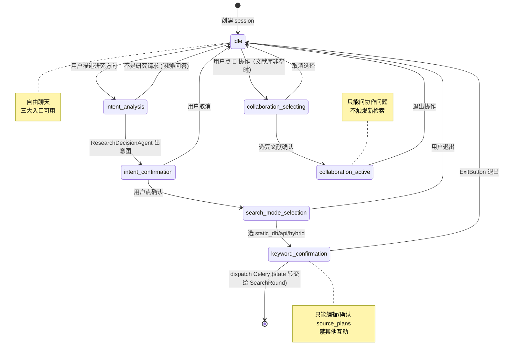
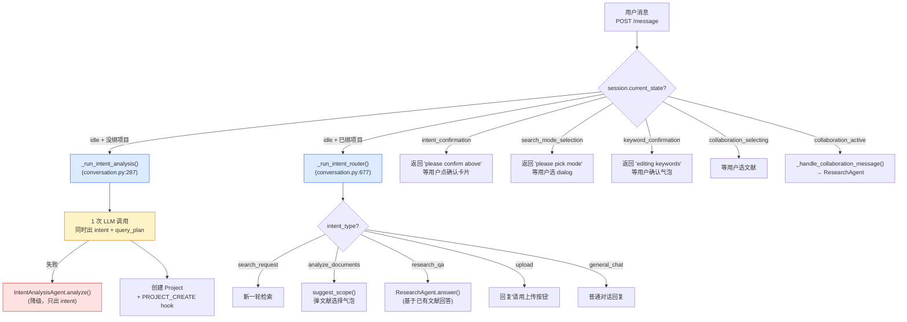
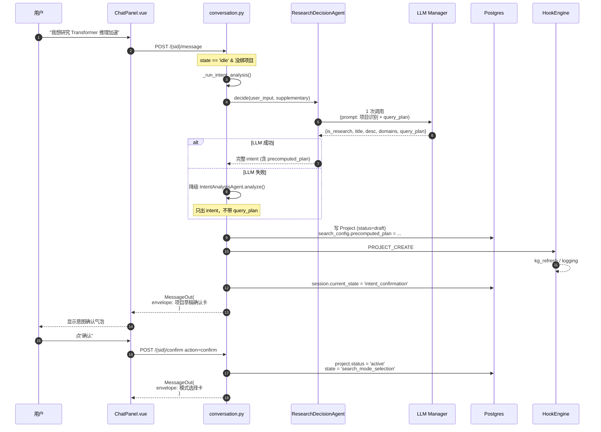
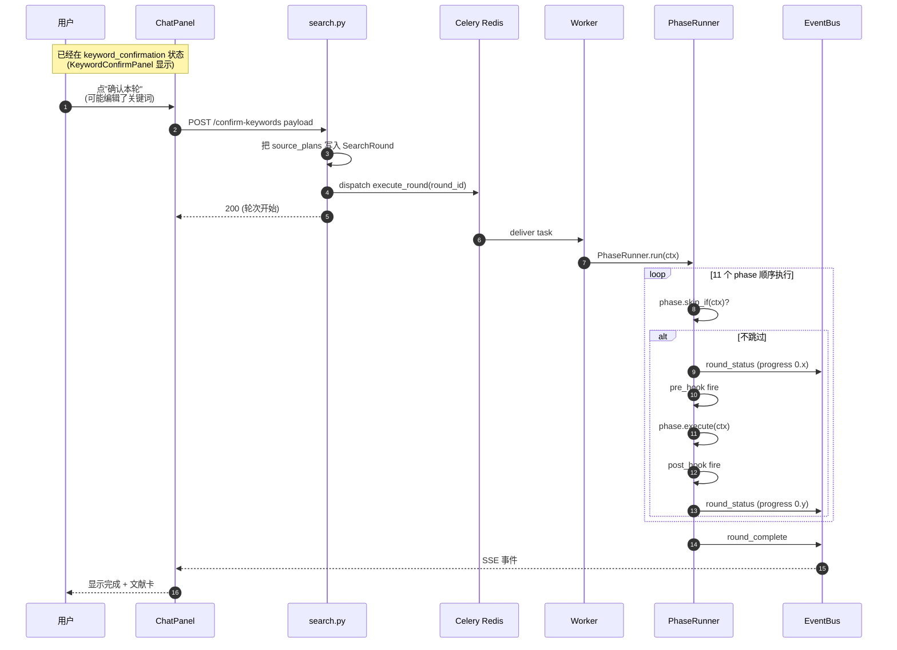
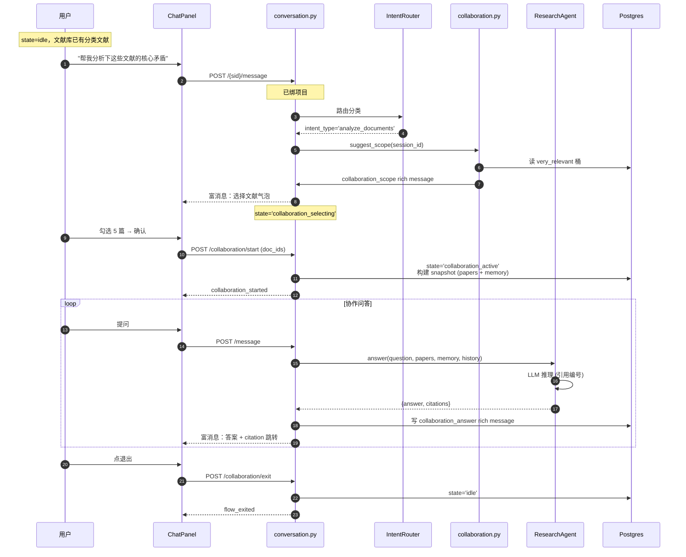
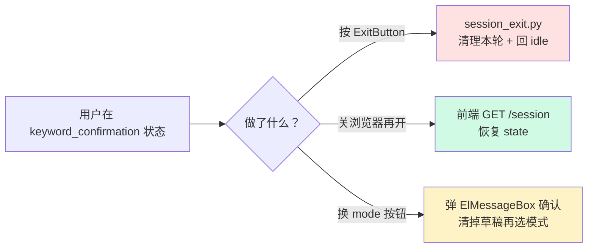

# 02 · 对话流程与状态机

> **核心问题**：用户在 ChatPanel 里发一句话，系统怎么决定下一步是分析意图、确认关键词，还是路由到协作模式？

---

## 1. 状态机：7 个状态

`ConversationSession.current_state` 决定**当前可以做什么**，CLAUDE.md「对话状态机原则」是顶层锚点。

**状态规则**：
- 默认 `idle`：自由聊天 + 三大功能入口（检索 / 协作 / 定时推送）
- 一旦进流程**必须走完或显式退出**，中途不能切流程
- 非 `idle` 状态下输入只路由给当前流程的 handler
- 前端按钮根据 state 联动启用/禁用（FunctionDock + FeatureGate）

---

## 2. send_message 路由分派

每次用户发消息（`POST /api/conversation/{sid}/message`），`backend/app/api/conversation.py:287` 根据 state 决定路径：

---

## 3. 三大场景的端到端调用链

### 场景 A · 创建项目

### 场景 B · 执行一轮检索（高层）

详细 phase 见 [03-search-pipeline.md](./03-search-pipeline.md)。

### 场景 C · 协作研究

---

## 4. 关键代码位置

| 关注点 | 文件:行号 |
|---|---|
| send_message 路由 | `backend/app/api/conversation.py:287` |
| _run_intent_analysis | `backend/app/api/conversation.py:143` |
| _run_intent_router (项目内分类) | `backend/app/api/conversation.py:677` |
| _create_project_from_intent | `backend/app/api/conversation.py:166` |
| confirm 路径（项目→模式选择→关键词）| `backend/app/api/conversation.py:572-650` |
| state 枚举 + 转换守卫 | `backend/app/services/session_state_registry.py` |
| FeatureGate（前端按钮启用矩阵）| `backend/app/services/feature_gate.py` + `frontend/src/composables/useFeatureGate.ts` |
| ExitButton（退出当前流程）| `frontend/src/components/conversation/ExitButton.vue` + `backend/app/api/session_exit.py` |

---

## 5. 异常路径设计

### 流程被中途打断

### LLM 失败的统一降级

| 场景 | 主路径 | 降级 |
|---|---|---|
| 创建项目 | ResearchDecisionAgent (1 次 LLM 出 intent + query_plan) | IntentAnalysisAgent (只出 intent，query_plan 留空让 QueryPlanAgent 后补) |
| 检索 | QueryPlanAgent.agentic_plan() | build_query() 确定性函数 |
| 评分 | ScoringAgent.score_all() | relevance_engine 传统分数 |
| 协作回答 | ResearchAgent.answer() | 通用"分析暂不可用"消息 |

每次降级都会写日志 + 不抛给用户，UI 仍能继续走。

---

## 6. 跟代码同步的小技巧

- **找路由**：`backend/app/main.py:101-125` 注册了 24 个 router，全在 `app/api/`
- **找 state 转换的入口**：grep `current_state =` 在 `app/api/conversation.py` 看所有显式赋值
- **找发往前端的 rich message**：grep `rich_type=` 看产生方；前端消费方在 `frontend/src/components/conversation/RichMessageDispatcher.vue`
- **找异步事件**：`event_bus.py` 的 `publish_sync` / `publish_async` 调用方就是 SSE 推送源

---

## 下一步

- 看检索 phase 内部怎么编排 → [03-search-pipeline.md](./03-search-pipeline.md)
- 看 10 个 agent 各自做什么 → [04-agent-roles.md](./04-agent-roles.md)
