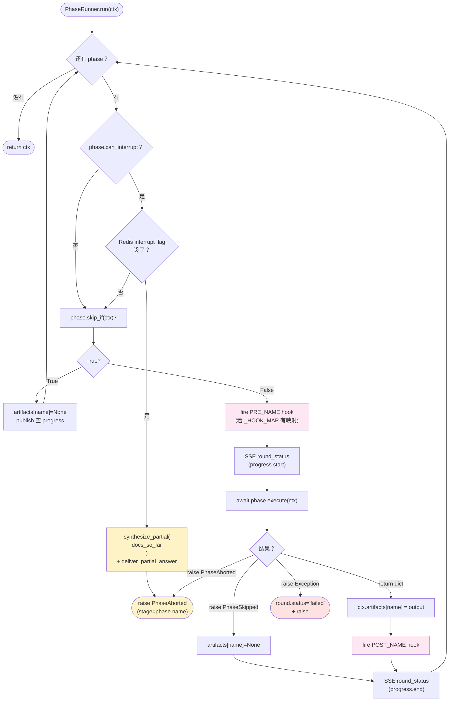
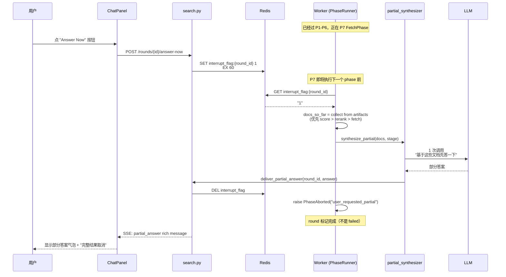
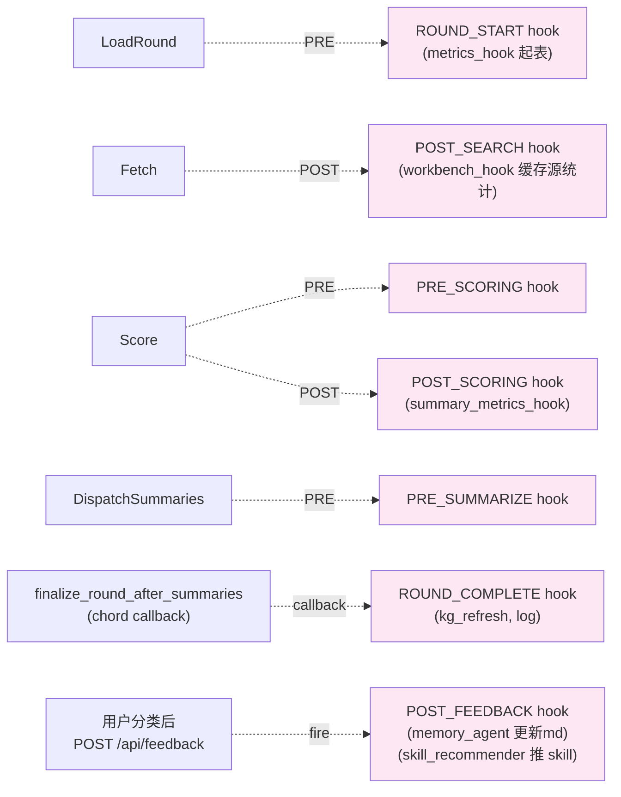

# 03 · 检索流水线（PhaseRunner DAG）

> **核心问题**：用户点"开始检索"后，Celery worker 跑了什么？11 个 phase 怎么协作？怎么处理 LLM 失败 / 用户中断 / 部分结果？

---

## 1. PhaseRunner 全景

```mermaid
flowchart TD
    Start(["execute_round(round_id)<br/>workers/search_tasks.py:29"])
    Start --> P1
    
    P1["1. LoadRoundPhase<br/>读 round + scoring_weights<br/>artifact: round 元数据"]
    P2["2. BuildDedupPhase<br/>读历史 RoundDocument<br/>artifact: prev_doc_ids set"]
    P3["3. LoadMemoryPhase<br/>build_combined_memory_for_agents()<br/>artifact: 用户md + 项目md 拼接文本"]
    P4["4. PlanQueryPhase 🤖<br/>QueryPlanAgent.agentic_plan()<br/>失败 → build_query() fallback<br/>artifact: QueryPlan (sources, base_query, year)"]
    P5["5. LoadConfirmedKeywordsPhase<br/>读用户在前端确认/编辑过的<br/>per_source_queries (Redis 暂存)"]
    P6["6. ApplySearchModePhase<br/>按 static_db / api / hybrid<br/>过滤要查的 sources"]
    P7["7. FetchPhase ⚡<br/>AgentSearchLoop.run()<br/>asyncio.gather 并行 14 源<br/>最多 3 次自适应迭代<br/>can_interrupt: ✅"]
    P8["8. RerankPhase<br/>citation_count + recency + LLM<br/>can_interrupt: ✅"]
    P9["9. ScorePhase 🤖<br/>ScoringAgent.score_all()<br/>每篇 0-10 分 + 一句话理由<br/>失败 → relevance_engine fallback<br/>can_interrupt: ✅"]
    P10["10. SaveDocsPhase<br/>写 Document + RoundDocument<br/>+ 索引"]
    P11["11. DispatchSummariesPhase<br/>chord(generate_summary × N)<br/>(finalize)<br/>can_interrupt: ✅"]
    Done(["round.status='complete'<br/>+ ROUND_COMPLETE hook"])
    
    P1 --> P2 --> P3 --> P4 --> P5 --> P6 --> P7 --> P8 --> P9 --> P10 --> P11 --> Done
    
    classDef llm fill:#dbeafe,stroke:#2563eb
    classDef interruptible fill:#fef3c7,stroke:#d97706
    classDef io fill:#d1fae5,stroke:#059669
    
    class P4,P9 llm
    class P7,P8,P9,P11 interruptible
    class P1,P3,P5,P10 io
```



---

## 2. 每个 Phase 详解

| # | Phase | 文件 | LLM？ | 可中断？ | progress | 输出 |
|---|---|---|---|---|---|---|
| 1 | LoadRoundPhase | `harness/pipeline/phases/load_round.py` | ❌ | ❌ | 0.00–0.05 | round + project + scoring_weights |
| 2 | BuildDedupPhase | `phases/build_dedup.py` | ❌ | ❌ | 0.05–0.07 | prev_doc_ids set |
| 3 | LoadMemoryPhase | `phases/load_memory.py` | ❌ | ❌ | 0.07–0.10 | combined_memory_text (markdown) |
| 4 | PlanQueryPhase | `phases/plan_query.py` | ✅ | ❌ | 0.10–0.20 | QueryPlan |
| 5 | LoadConfirmedKeywordsPhase | `phases/load_confirmed_keywords.py` | ❌ | ❌ | 0.20–0.22 | per_source_queries |
| 6 | ApplySearchModePhase | `phases/apply_mode.py` | ❌ | ❌ | 0.22–0.25 | filtered sources |
| 7 | FetchPhase | `phases/fetch.py` | ❌（但有 LLM 内部 trip-loop） | ✅ | 0.25–0.55 | docs + per_source_stats |
| 8 | RerankPhase | `phases/rerank.py` | 可选 | ✅ | 0.55–0.65 | reranked_docs |
| 9 | ScorePhase | `phases/score.py` | ✅ | ✅ | 0.65–0.85 | above_cutoff / below_cutoff |
| 10 | SaveDocsPhase | `phases/save_round.py` | ❌ | ❌ | 0.85–0.90 | saved IDs |
| 11 | DispatchSummariesPhase | `phases/dispatch_summaries.py` | ✅ | ✅ | 0.90–1.00 | (chord 异步写回) |

---

## 3. PhaseRunner 内部循环（含 skip_if + Hook）



代码位置：`backend/app/harness/pipeline/runner.py:85-130`

---

## 4. RoundContext —— phase 共享数据的"信箱"

```python
@dataclass
class RoundContext:
    round_id: str
    db: AsyncSession
    redis: Redis
    llm_manager: LLMManager
    round: SearchRound        # 由 LoadRoundPhase 填
    project: Project          # 由 LoadRoundPhase 填
    session_id: str | None
    artifacts: dict[str, Any] # 每个 phase 的输出按 name 存这里
```

每个 phase 用 `ctx.get("plan_query")` 读上游，用 `return {...}` 写自己的输出。

**特点**：
- `ctx.artifacts` 在内存里，**不持久化**（崩了从头跑，没 checkpoint）
- `RoundContext` 不是 frozen，下游 phase 也可以改 `ctx.round` 之类的 ORM 实例（但避免）
- DAG 校验在 `__init__`：`PhaseRunner._topo_sort` 用 Kahn 算法 + 环检测

---

## 5. Answer Now（部分结果中断）

用户在长检索（30-60s）中可以点"现在就给我答复"，让系统中断并合成部分答案：



代码：
- 标志位写：`backend/app/api/search.py` (Answer Now endpoint)
- 标志位读：`harness/pipeline/runner.py:117 _maybe_partial`
- 合成逻辑：`backend/app/services/partial_synthesizer.py`

只有 phase 设了 `can_interrupt = True`（Fetch / Rerank / Score / DispatchSummaries）才会在执行**前**检查标志位。这避免了把 IO-heavy 的 Save 中断在写一半。

---

## 6. Hook 触发点



- `_HOOK_MAP` 在 `runner.py:33`：把 phase.name 映射到 PRE/POST HookPoint enum
- 没映射的 phase 不触发 hook
- ROUND_COMPLETE 不在 PhaseRunner 内触发，而在 chord callback 里（因为摘要是异步派发的）

---

## 7. 失败降级矩阵

| Phase | 主路径 | 降级 | 落地处 |
|---|---|---|---|
| PlanQueryPhase | QueryPlanAgent.agentic_plan (LLM) | build_query() (rule-based) | `phases/plan_query.py:48-65` |
| FetchPhase | 14 源并行 | 单源失败 → 收 partial_errors[]，前端黄框提示 | `services/fetchers/base.py` |
| RerankPhase | LLM rerank | citation/recency 传统打分 | `phases/rerank.py` |
| ScorePhase | ScoringAgent (LLM) | relevance_engine 传统分数 | `phases/score.py:80-90` |
| DispatchSummariesPhase | 每篇 LLM 摘要 | 失败摘要标记空，不阻塞 round | `workers/search_tasks.py` |

**原则**：**LLM 失败不能让整轮 fail**，能用规则就降级，UI 显示"AI 暂不可用，已用基础模式"。

---

## 8. 给开发者：怎么加一个 phase？

```python
# backend/app/harness/pipeline/phases/my_phase.py
from typing import Any
from ..types import RoundContext


class MyPhase:
    name = "my_phase"
    deps = ["plan_query"]              # 依赖谁的输出
    progress_range = (0.65, 0.70)      # 跟相邻 phase 不重叠
    can_interrupt = False
    # 可选：声明式跳过
    def skip_if(self, ctx: RoundContext) -> bool:
        return ctx.project.search_config.get("skip_my_phase", False)

    async def execute(self, ctx: RoundContext) -> Any:
        plan = ctx.get("plan_query")    # 读上游
        # ... 干活
        return {"foo": "bar"}           # 写自己的 artifact
```

注册：在 `backend/app/workers/search_tasks.py:84-96` 把 `MyPhase()` 加入 phases 列表。PhaseRunner 自动 topo sort + 校验依赖。

---

## 9. 真实运行时长（参考）

| Phase | 典型耗时 |
|---|---|
| LoadRound / BuildDedup / LoadMemory / LoadConfirmedKeywords / ApplyMode | 各 < 50ms |
| PlanQueryPhase | 1-3s（LLM）/ 100ms（fallback） |
| FetchPhase | 5-30s（取决于源数量、网络）|
| RerankPhase | 1-3s |
| ScorePhase | 5-15s（每篇 LLM × 并发 10）|
| SaveDocsPhase | 200-500ms |
| DispatchSummaries（chord 派发）| 500ms（派发瞬间，摘要本身几分钟）|

总：**用户点"开始"到 round.status="awaiting_feedback"** ≈ 30-60 秒。

---

## 下一步

- 看每个 agent 的接口和职责 → [04-agent-roles.md](./04-agent-roles.md)
- 看 round 完成后数据怎么进 DB / Memory / SSE → [05-data-flow.md](./05-data-flow.md)
