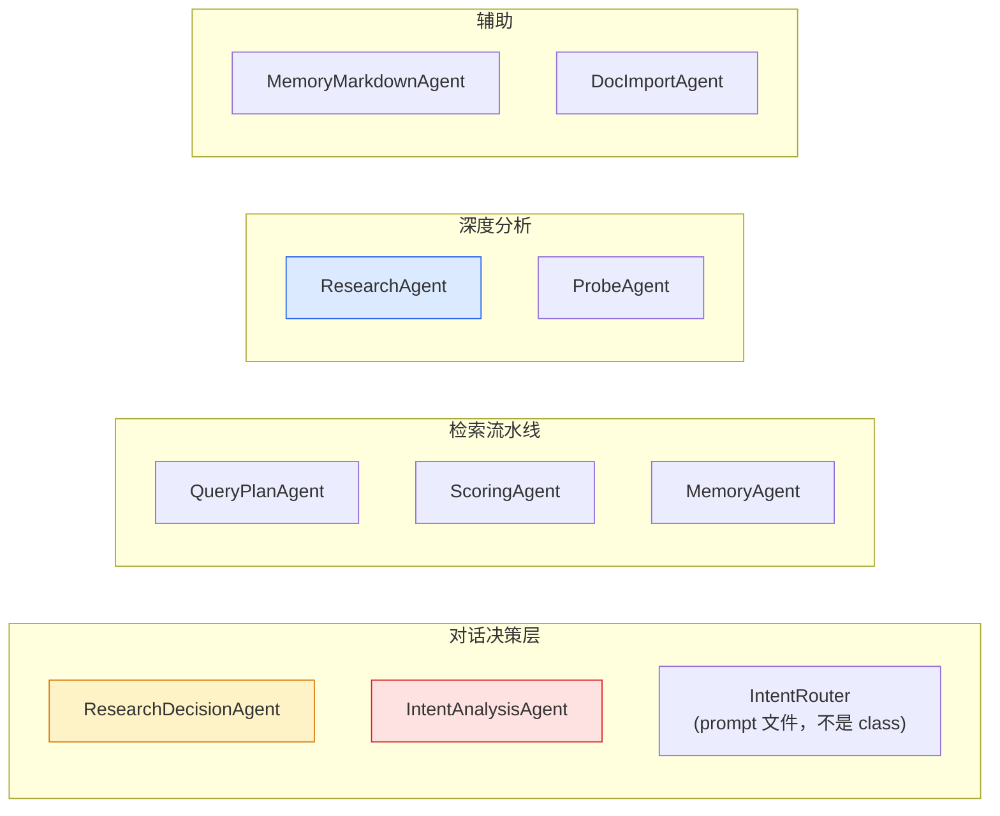
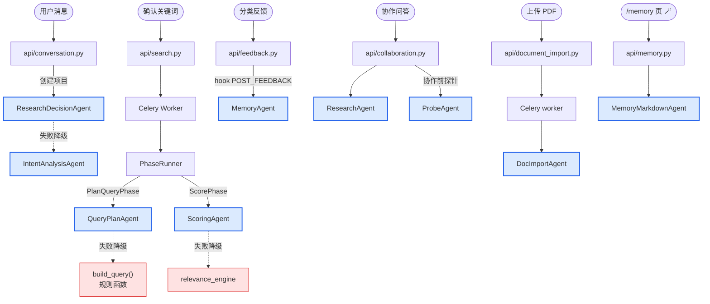
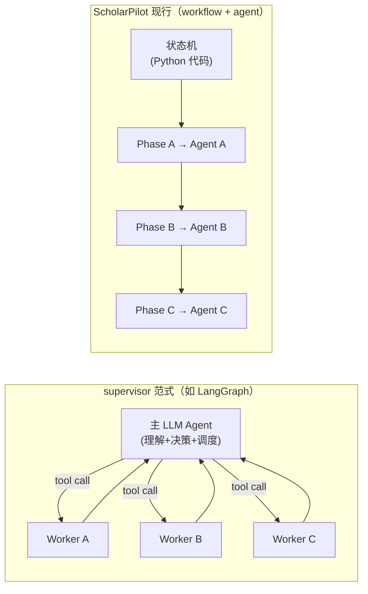
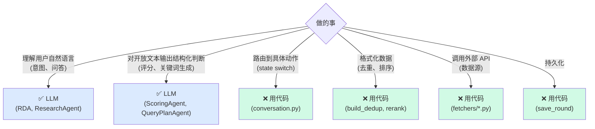
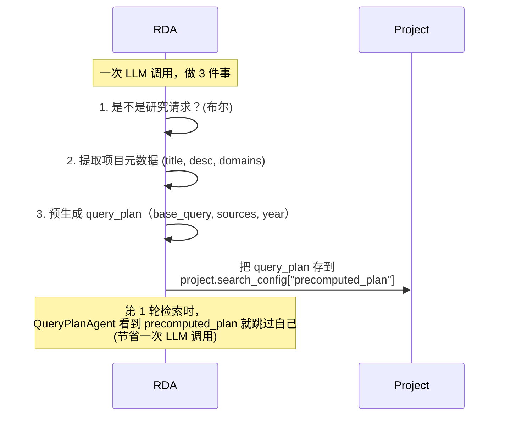
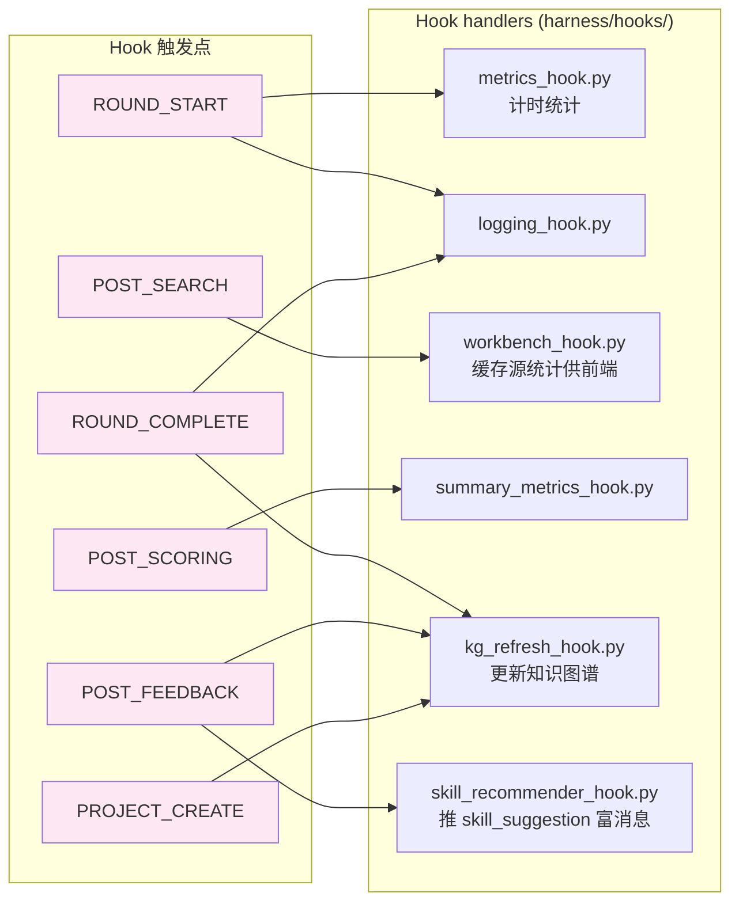
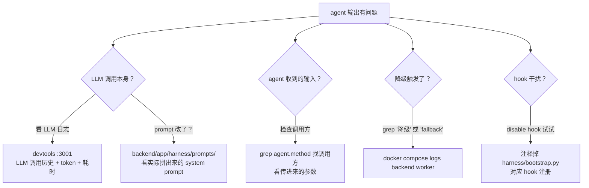

# 04 · Agent 角色与协作关系

> **核心问题**：项目里 10 个 agent 各做什么？谁调谁？为什么不是"主 agent + 子 agent"模式？

---

## 1. 10 个 agent 一览

---

## 2. 详细规格表

| Agent | 文件 | 调用方 | 输入 | 输出 | 失败降级 |
|---|---|---|---|---|---|
| **ResearchDecisionAgent** | `harness/agents/research_decision_agent.py` | `api/conversation.py:143` 创建项目时一次性调用 | `user_input`, `supplementary_context` | `{is_research_request, title, description, domains, query_plan?}` | → IntentAnalysisAgent |
| **IntentAnalysisAgent** | `harness/agents/intent_agent.py` | RDA 失败时降级 / `manual_live_json_mode.py` 测试 | 同上 | `{is_research_request, title, description, ...}`（不含 query_plan） | 无（最后兜底）|
| **QueryPlanAgent** | `harness/agents/query_plan_agent.py` | `phases/plan_query.py:48` 每轮检索 | `project_description`, `memory_text`, `round_number`, `tool_reliability` | `QueryPlan(base_query, sources, year_from/to, exclude_terms)` | `build_query()` 规则函数 |
| **ScoringAgent** | `harness/agents/scoring_agent.py` | `phases/score.py:56` 每轮检索 | `docs[]`, `project_description`, `cutoff`, `user_memory` | `{above_cutoff: [{doc, score, reasoning}], below_cutoff: [...]}` | `relevance_engine` 传统分数 |
| **ResearchAgent** | `harness/agents/research_agent.py` | `api/conversation.py:799` & `api/collaboration.py` 协作问答 | `question`, `papers`, `project_description`, `conversation_history` | `{answer, citations: [{doc_id, snippet}]}` | "暂不可用"消息 |
| **ProbeAgent** | `harness/agents/probe_agent.py` | `api/collaboration.py:940` 协作前的 section 级精读探针 | doc + question | `[{section_label, excerpt_quote, relevance, insight}]` | 跳过探针，退化 full_text[:8000] |
| **MemoryAgent** | `harness/agents/memory_agent.py` | `api/feedback.py:154` & `api/search.py:793` 用户分类后 | `project_description`, `current_memory`, `feedback_buckets` | `updated_memory_text` (markdown) | 保留旧 memory_text |
| **MemoryMarkdownAgent** | `harness/agents/memory_markdown_agent.py` | `api/memory.py:97/222` /memory 页"🪄 从对话提炼"按钮 | conversation_messages, current_md | refined_md | 保留旧 md |
| **DocImportAgent** | `harness/agents/doc_import_agent.py` | `workers/import_tasks.py:19` 用户上传 PDF | parsed PDF text + project | `{title, authors, abstract, ai_summary}` | 失败标记，让用户手动填 |

---

## 3. Agent 之间的调用关系

**关键观察**：
- 所有 agent 调用方**只有 4 类**：FastAPI router / Celery worker / PhaseRunner / Hook handler
- **agent 之间没有相互调用**——这是有意为之的解耦设计
- 每个 agent 只负责自己那一锤子活，不知道下游谁会用结果

---

## 4. 为什么不是 supervisor 范式？

业界（LangGraph / OpenAI Swarm / Anthropic）目前流行"主 agent 路由 + 子 agent 工作"的 supervisor pattern。**ScholarPilot 没用这个**，理由：

| 维度 | supervisor | ScholarPilot |
|---|---|---|
| 路由决策 | LLM 推理（每条消息都过一次主 LLM） | Python `current_state` switch（固定确定）|
| 决策成本 | $$$（每轮 N 次 LLM）| 零（代码）|
| 决策延迟 | 1-3s | 微秒 |
| 输出可预测性 | LLM 可能跑偏到不该走的路径 | 固定路径，非常可预测 |
| 灵活度 | 极高（适合开放对话）| 中（需先定义 state）|
| 适用场景 | 开放助手 / 编码代理 / 多领域问答 | **强结构 workflow**（如科研检索）|

**Anthropic 自己的 "Building effective agents" 一文也强调**："Don't use agents when workflows suffice"。ScholarPilot 的核心流程（项目→关键词→检索→反馈）正是 workflow，所以选这个范式是对的。

---

## 5. 何时该用 LLM？何时不该？

项目里 LLM 调用集中在这几个场景：

**红线**：能用代码确定性解决的，**绝不让 LLM 兜**。代码错可调试，LLM 错难复现。

---

## 6. ResearchDecisionAgent 的特殊地位

它是项目里**最像主 agent**的角色，但只在创建项目时跑一次：

**为什么 RDA 把 3 件事打包**：
- 节省 LLM 调用（创建项目 → 第一轮检索原本要 2 次，合一次）
- 第 1 轮的 query_plan 与意图判断是高度相关的（一句话讲清楚研究方向就能产生关键词）

**潜在问题**：
- precomputed_plan 没有"用一次后失效"的机制，可能被复用导致后续轮不更新（CLAUDE.md 没明示）
- 第 1 轮和后续轮走两条不同代码路径，维护成本高

详见 [03-search-pipeline.md](./03-search-pipeline.md#7-失败降级矩阵) 关于 PlanQueryPhase 的说明。

---

## 7. Hook 系统：横切关注点

10 个 agent 不直接互相依赖，但**很多副作用通过 Hook 触发**：

**Hook 系统的核心价值**：
- 加新功能不用改主流程代码（KG / 推荐 / 指标都是后挂的）
- 失败可隔离（hook 抛异常只 log，不影响主流程）
- 可单测（hook 与 phase 解耦）

代码：`backend/app/harness/hook_engine.py` + `harness/hooks/*.py`

---

## 8. 给 agent 加个新成员的清单

要加一个 `LiteratureGapAgent`（找文献空白）？

1. 在 `backend/app/harness/agents/` 加 `literature_gap_agent.py`
2. 在 `harness/prompts/` 加对应 prompt（参考 `query_plan.py`）
3. **决定调用方**：
   - 如果是检索的一部分 → 加新 phase（见 [03-search-pipeline.md#8-给开发者怎么加一个-phase](./03-search-pipeline.md#8-给开发者怎么加一个-phase)）
   - 如果是用户主动触发 → 加 API endpoint
   - 如果是反馈后自动 → 注册到某个 hook
4. **降级策略**：明确"LLM 失败时返回什么"
5. 写测试：`tests/harness/test_literature_gap_agent.py`

**不要做的事**：
- ❌ 让新 agent 调其他 agent（保持 agent 之间无依赖）
- ❌ 让 agent 自己写 DB（让调用方写）
- ❌ 让 agent 跨 round 持有状态（agent 是函数式的，每次调用独立）

---

## 9. 调试一个失灵的 agent

---

## 下一步

- 看数据流向（DB / Redis / SSE 全链）→ [05-data-flow.md](./05-data-flow.md)
