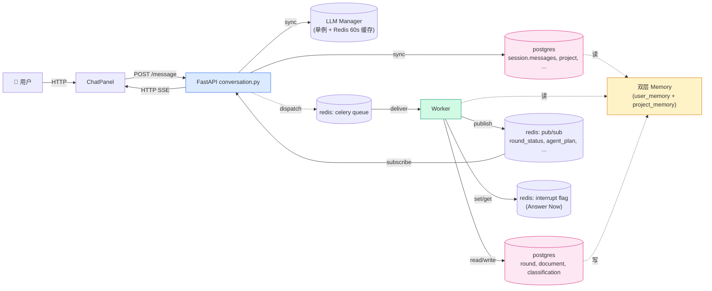
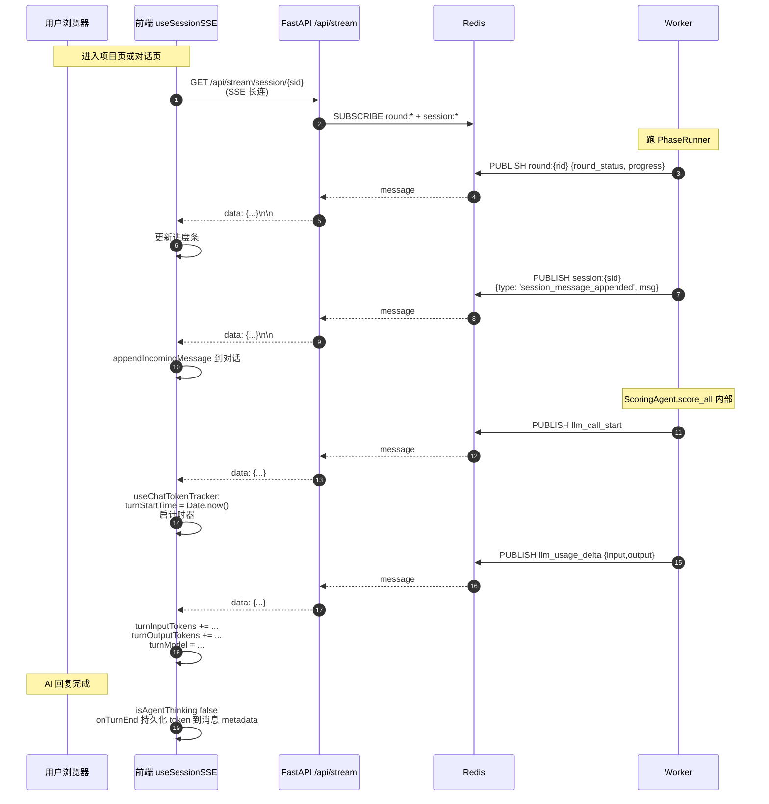
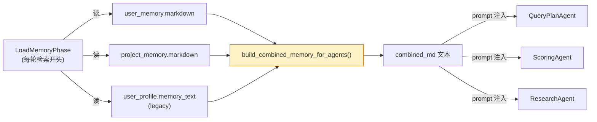
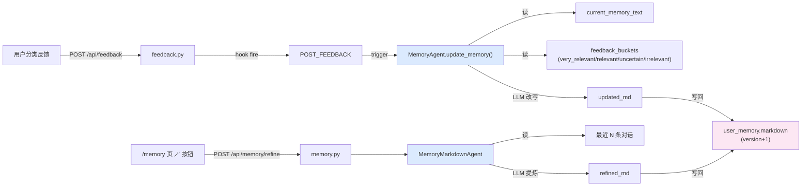
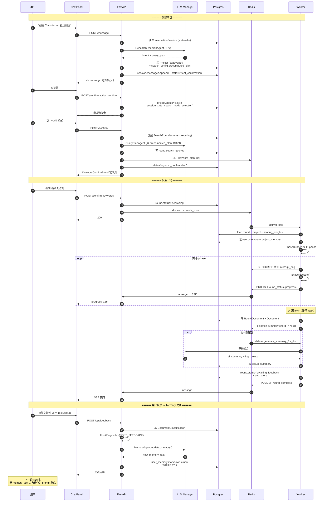
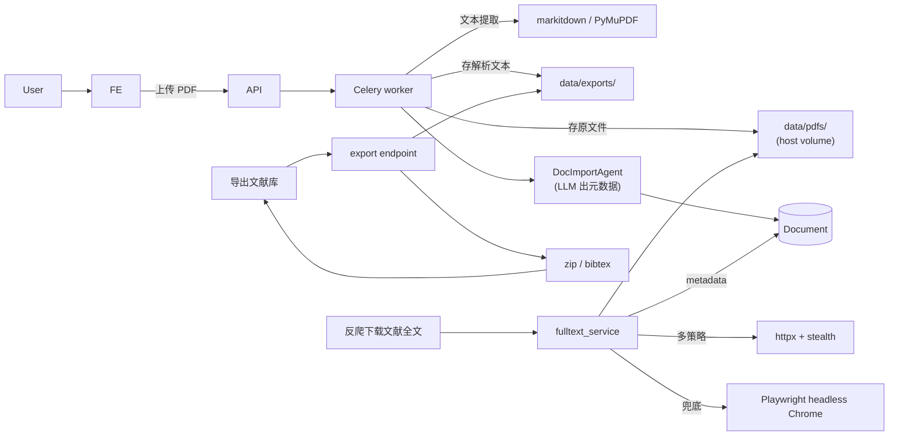
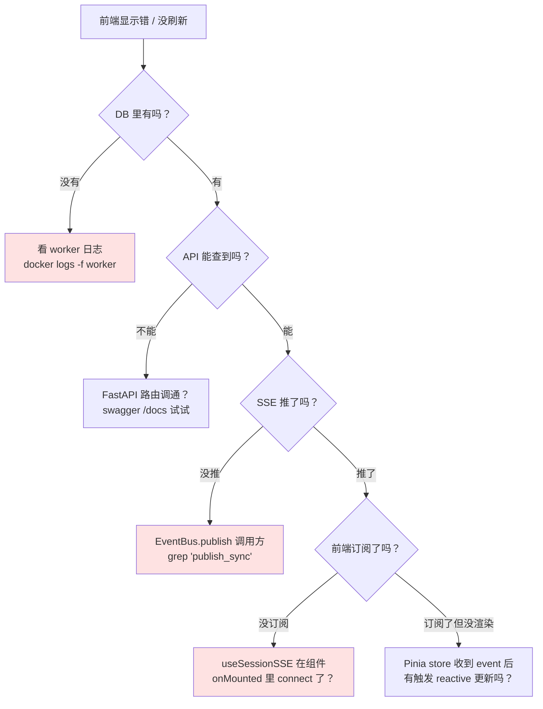

# 05 · 数据流向（DB · Redis · SSE · Memory）

> **核心问题**：用户的一句话，如何变成 DB 行、Redis 缓存、SSE 推送、最终回到前端？双层 Markdown memory 什么时候读、什么时候写？

---

## 1. 全链数据流总图



---

## 2. PostgreSQL 关键表

```mermaid
erDiagram
    USER ||--o{ PROJECT : owns
    USER ||--|| USER_PROFILE : has
    USER ||--o{ USER_MEMORY : has
    USER ||--o{ INVITATION_CODE : redeemed
    PROJECT ||--o{ PROJECT_MEMORY : has
    PROJECT ||--o{ SEARCH_ROUND : runs
    PROJECT ||--o{ DOCUMENT : "owns refs"
    PROJECT ||--o{ MONITOR_JOB : monitors
    PROJECT ||--o{ DOCUMENT_CLASSIFICATION : classified
    PROJECT ||--o{ CONVERSATION_SESSION : "1+ sessions"
    SEARCH_ROUND ||--o{ ROUND_DOCUMENT : produces
    DOCUMENT ||--o{ ROUND_DOCUMENT : "linked"
    DOCUMENT ||--o{ DOCUMENT_CLASSIFICATION : classified
    CONVERSATION_SESSION ||--o{ MESSAGE : contains
    MONITOR_JOB ||--o{ MONITORING_PUSH : sends
    PROJECT ||--o{ DOCUMENT_IMPORT_JOB : "PDF imports"
    PROJECT ||--o{ RESEARCH_NOTE_PAGE : notebook
    USER ||--o{ USER_FEEDBACK : "site feedback"

    USER {
        uuid id PK
        string email
        string hashed_password
        bool is_admin
        text invitation_code_id
    }
    PROJECT {
        uuid id PK
        uuid user_id FK
        string title
        text description
        json search_config
        int current_round
        string status
    }
    SEARCH_ROUND {
        uuid id PK
        uuid project_id FK
        int round_number
        string status
        json source_stats
        json search_queries
    }
    DOCUMENT {
        uuid id PK
        uuid project_id FK
        string title
        text abstract
        text ai_summary
        json ai_key_points
        float relevance_score
    }
    CONVERSATION_SESSION {
        uuid id PK
        uuid user_id FK
        uuid project_id FK NULL
        string current_state
        json messages
        json pending_confirmation
    }
    USER_MEMORY {
        uuid id PK
        uuid user_id FK
        text markdown
        int version
    }
    PROJECT_MEMORY {
        uuid id PK
        uuid project_id FK
        text markdown
        int version
    }
```

注：实际 schema 由 `backend/app/models/*.py` 定义，alembic 0001→0022 累计迁移。本图突出主关系，省略时间戳和不重要字段。

---

## 3. Redis 用途

| Key 模式 | 内容 | TTL | 谁读谁写 |
|---|---|---|---|
| Celery default queue | 任务列表（execute_round / generate_summary / 等）| — | API 写、worker 读 |
| `llm:config` | 当前活跃 LLM 提供商 + token/参数 | 60s | LLMManager 单例读写 |
| `keyword_plan:{round_id}` | per-source 查询词草稿（用户编辑前后）| ~1h | conversation.py & search.py 读写 |
| `interrupt_flag:{round_id}` | "用户点了 Answer Now" 标志 | 60s | API 写、PhaseRunner 读 |
| `recipe:lock:{project_id}` | 项目食谱再生成 SET-NX-EX dedup | 60s | recipe_tasks |
| `stale_hint:{project_id}` | 距上次检索 N 天的去重 + 用户 dismiss | 7d | telemetry & staleness |
| `dev_log:*` | DevTools 日志缓冲 | rolling | log_writer & devtools UI |
| pub/sub channel `round:{round_id}` | SSE 事件流 | 一次性 | EventBus |

代码：`backend/app/services/event_bus.py` + 各 service。

---

## 4. SSE 推送链



**前端订阅（commit 1d7918f 之后）**：
- `composables/useSessionSSE.ts` — 通用 SSE 连接管理
- `composables/useChatTokenTracker.ts` — 专门处理 token 实时追踪（这次重构抽出来的）
- `composables/useSSE.ts` — collaboration store 用

---

## 5. 双层 Markdown Memory 系统

### 5.1 概念

| 层 | 表 | 范围 | 谁能改 |
|---|---|---|---|
| **用户级** | `user_memory` | 跨项目共享（"我是 CS 学生，关注 LLM 推理"）| 用户在 /memory 页编辑 + MemoryAgent 自动追加 |
| **项目级** | `project_memory` | 仅当前项目（"本项目研究 KV cache 量化"）| 同上 |
| **(legacy)** | `user_profile.memory_text` | 老的 markdown 字段，跟 user_memory 部分功能重叠 | MemoryAgent 自动改写 |

CLAUDE.md 标注的 "双层 Markdown 记忆" 指的是**用户级 + 项目级**，CLAUDE.md memory「embedding 已彻底放弃」指 commit a34b48a 删除了向量字段。

### 5.2 何时读



代码：
- `backend/app/services/markdown_memory.py: build_combined_memory_for_agents()`
- 调用方 `harness/pipeline/phases/load_memory.py:28-34`

### 5.3 何时写



### 5.4 版本机制

`user_memory.version` 单调递增，每次 MemoryAgent 改写 +1。前端在 /memory 页可以看到历史版本（如有）。

---

## 6. 一次完整的"创建项目→检索→反馈"数据流



---

## 7. 文件存储



`data/` 在 host 上是 `D:\AI\scholarpilot-dev\data\`，docker volume 挂载到容器 `/app/data`，详见 [01-system-overview.md](./01-system-overview.md#5-数据持久化)。

---

## 8. 给开发者：怎么排查"数据没到前端"



---

## 9. 总结

ScholarPilot 数据流的设计哲学：

1. **DB 是 source of truth**——任何 agent 输出最终都要落地，临时态只在 RoundContext.artifacts（内存）
2. **Redis 是高速通道**——队列 / 缓存 / pub-sub 三件套，但**不存业务数据**
3. **SSE 是单向通知**——前端不通过 SSE 写后端，只接收事件
4. **Memory 是跨轮持久化**——user/project 两层 markdown，用户级跨项目，项目级仅本项目，下游 agent 通过 prompt 注入消费
5. **失败不阻塞**——hook 抛错只 log，agent 失败有降级，单源失败收 partial_errors[]

---

## 完结

至此你已经看完 ScholarPilot 架构的 5 个维度：
1. ✅ 系统全景（容器架构）
2. ✅ 对话流程（状态机 + 路由）
3. ✅ 检索流水线（PhaseRunner DAG）
4. ✅ Agent 角色（10 个 agent）
5. ✅ 数据流向（DB / Redis / SSE / Memory）

回到 [README](./README.md) 查看其它路径。
