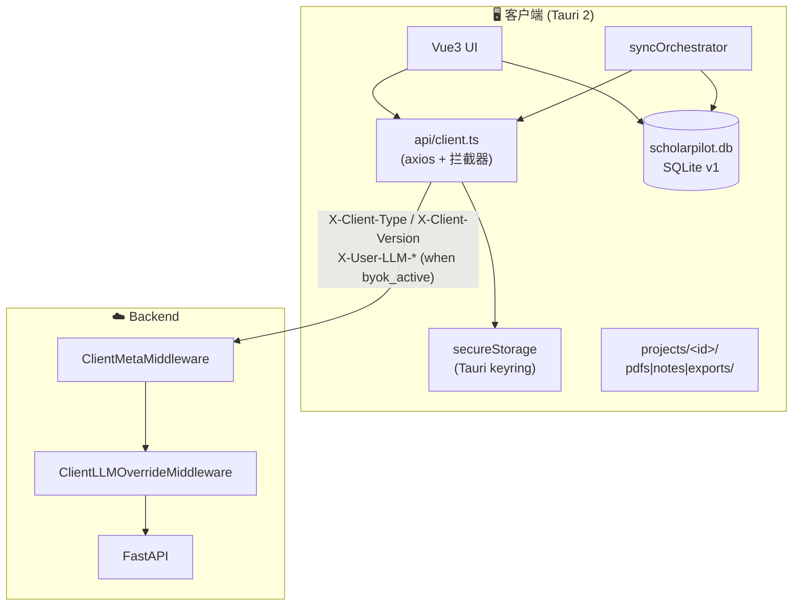
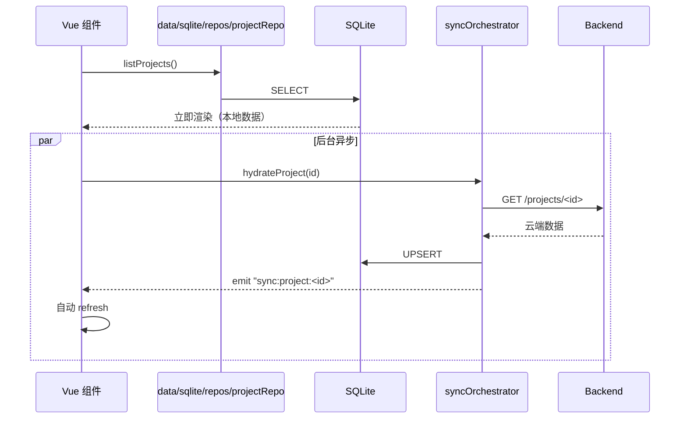
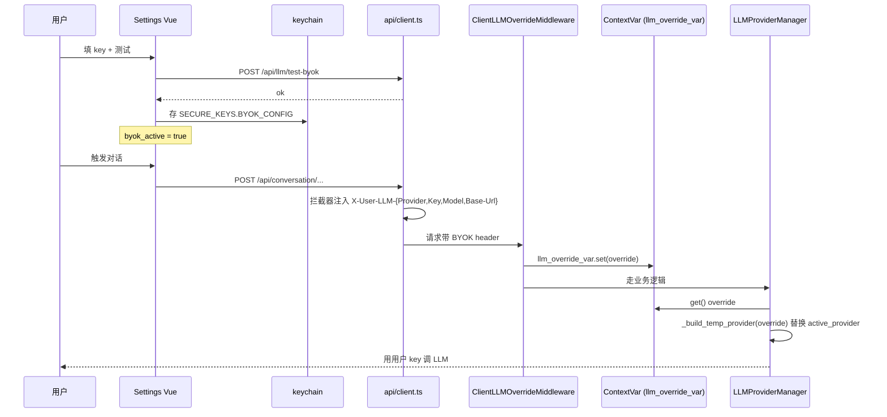

# 06 · 桌面客户端（Tauri 2 + Vue3）

> 本地优先 / 离线能力 / BYOK 透传。基于 commit `*`（2026-04-30 之后定期同步）。

---

## 1. 三个里程碑速览

| M | 主题 | 关键能力 |
|---|---|---|
| **M1**（2026-04-29）| 客户端壳 | Vue3 平移 + Tauri 2 容器 + OAuth2 双 token + keychain + 三端 CI |
| **M2**（2026-04-29）| 本地数据层 | SQLite 11 表 + 7 repos + Tauri fs sandbox + 4 sync services + OfflineIndicator |
| **M3**（2026-04-30）| BYOK 透传 | 客户端注入 X-User-LLM-* + backend ContextVar 替换 active_provider；Web 零影响 |

详细 spec / plan 在 `docs/superpowers/specs|plans/2026-04-29-*` / `2026-04-30-*`。

---

## 2. 总体架构



---

## 3. M1 · 客户端壳

### 认证
- OAuth2 双 token：access (短) + refresh (30d)
- Token 存 **OS keychain**：Win Credential Manager / macOS Keychain / Linux Secret Service
- **不**存 localStorage（避免 XSS 偷取）
- 401 → axios 拦截器自动 refresh 一次，再失败才跳登录

### 客户端识别 header
所有请求带：
- `X-Client-Type: desktop`
- `X-Client-Version: <semver>`

后端 `ClientMetaMiddleware` 解析 → `request.state.client_meta`，下游 endpoint 可分流（如 desktop-only feature）。

### CI
三端构建 workflow：Windows `.msi` / macOS `.dmg` / Linux `.deb`，按 `paths` 触发只在 `client/**` 改动时跑。

---

## 4. M2 · 本地数据层

### 目录布局

```
<AppData>/scholarpilot/
├── scholarpilot.db          # SQLite v1
└── projects/<project_uuid>/
    ├── pdfs/
    ├── full_text/
    ├── notes/
    └── exports/
```

### SQLite 11 表（对齐 backend `app/models/`）

`projects` / `search_rounds` / `documents` / `round_documents` / `document_classifications` / `conversation_sessions` / `messages` / `research_note_pages` / `settings` / `sync_state` / `meta_kv`

**类型约定**：
- 时间 → `INTEGER`（unix-ms）
- JSON 字段 → `TEXT`（应用层 JSON.parse）
- UUID → `TEXT`

### Tauri fs sandbox

`commands/fs.rs` 暴露 `fs_*` 系列命令，所有 path 强制：
- 必须在 `<AppData>/scholarpilot/projects/<id>/` 下
- 拒绝 `..` 越界

### 同步策略（本地优先）



主要 sync services（`client/src/data/sync/`）：
- `projectsSyncService.ts` / `roundsSyncService.ts` / `documentsSyncService.ts` / `userDocumentsSyncService.ts` — 各资源同步
- `silentPdfReconciler.ts` — PDF 后台重对账
- `syncWorker.ts` + `syncWorkerClient.ts` — Web Worker 通信
- `syncOrchestrator.ts` — 顶层调度（`startupHydrate` / `hydrateProject` / `hydrateRoundResults`）

repos 在 `client/src/data/sqlite/repos/`：`projectRepo` / `roundRepo` / `documentRepo` / `conversationRepo` / `notebookRepo` / `settingsRepo` / `syncStateRepo`。

### 后端配合（M2 核心改造）

- `search_rounds.expires_at` 在 `finalize_round_after_summaries` 设为 `NOW + 7d`
- Celery beat `cleanup-expired-rounds` 每日 03:30：删过期 round（CASCADE 带走 `round_documents`，**不**删 `documents` 全局表，可能跨项目共享）

### 离线能力矩阵

| 能力 | 在线 | 离线 |
|---|---|---|
| 查看已同步过的 project / round / document / message | ✅ | ✅ |
| 新检索 / 新对话 / PDF 下载 | ✅ | ❌ |

顶栏 **OfflineIndicator**（`components/common/OfflineIndicator.vue` + `composables/useOnlineStatus.ts`）显示：在线 / 同步中 / 已同步 / 同步失败 / 离线。

### 不在 M2 范围（→ M7 加密同步一起做）

双向同步、冲突合并、离线发送的消息回放。

---

## 5. M3 · BYOK 透传

### 用户视角

`/settings` → `§02 BYOK · 我的 Key` tab → 选 OpenAI / Anthropic / DeepSeek / Moonshot / 自定义 → 填 key + model + base_url → 测试连接 → 保存。

### 数据流



### 关键不变量

- Key 存 **OS keychain**（`SECURE_KEYS.BYOK_CONFIG`），**不**入 backend / SQLite / log
- ApiClient 拦截器（`api/client.ts`）只在 `byok_active=true` 时注入 header
- backend `ClientLLMOverrideMiddleware`（`app/middleware/client_llm_override.py`）解析 → `request.state.user_llm_override` + `llm_override_var.set(...)`
- `LLMProviderManager.generate_full` 顶端读 ContextVar；conversation/ai_assist/notebook handler **一行不改**自动接入
- **Celery worker 不传播 ContextVar** → 检索流程永远走全局 LLM（spec §4.3：BYOK 仅作用于用户主动触发的 LLM 调用）

### 兼容性

- **Web 完全零影响**：`frontend/*` 0 改动，web 用户不发 BYOK header → middleware 透明 → 行为跟 M2 之前一致
- 测试覆盖：backend `pytest` 17 + client `vitest` 58

### 不在 M3 范围

- 客户端真正直连 LLM（绕过 backend）→ M3.1+
- 订阅 + 扣费 → M4
- BYOK 失败时 fallback 行为优化 → 用户反馈后再做

### ⚠️ 部署注意

部署生产 backend 前必须先解决 M2 cleanup beat 对 web 用户历史 round 的破坏（spec M3 §11 F1）。

---

## 6. 开发命令速查

```bash
cd client && npm install         # ~80MB
cd client && npm run dev         # 仅 vite，不起 Tauri 窗口
cd client && npm run tauri:dev   # 启 Tauri，首次 cargo 编译 5-10 分钟
cd client && npm run tauri:build # .msi / .exe / .dmg / .deb
cd client && npm run typecheck   # vue-tsc，独立可选
cd client && npm test            # vitest（M3 起 58 单测）
```

**前置依赖**（一次性）：
- Rust 1.95+ via rustup
- VS 2022 BuildTools / Community（C++ workload，仅 Windows）
- `~/.cargo/config.toml` 配 rsproxy 镜像（中国网络）
- `bash` 调 cargo 时若不在 PATH：`export PATH="$USERPROFILE/.cargo/bin:$PATH"`

---

## 7. 下一步

- 容器拓扑 → [01-system-overview.md](./01-system-overview.md)
- 对话状态机 → [02-conversation-flow.md](./02-conversation-flow.md)
- 数据流向（含双层 markdown 记忆）→ [05-data-flow.md](./05-data-flow.md)
