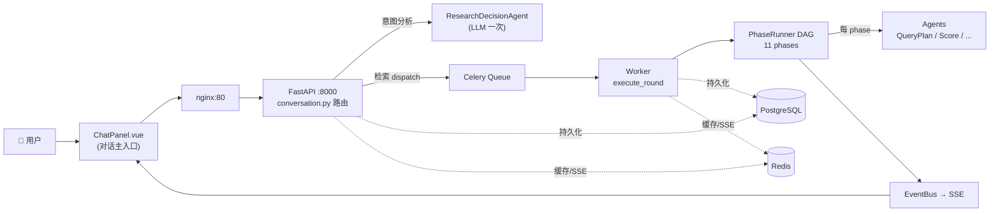

# ScholarPilot 架构可视化文档

> 这套文档把项目的调度策略、流程架构、agent 协作关系**全部画出来**，让读者不用啃代码就能 5 分钟搞清楚"用户的一句话怎么变成检索结果"。
>
> 所有图都是 mermaid 写的，**GitHub / VSCode / Obsidian 直接渲染**，不用装额外工具。

---

## 🎨 一键可视化（双击就看）

**[architecture-viewer.html](./architecture-viewer.html)** — self-contained 单文件可视化。在文件管理器里**双击它**，浏览器打开就能看 13 张核心架构图，左侧目录可切换，期刊风排版。

不依赖 GitHub 网页 / VSCode 插件，离线也能看（mermaid 走 CDN，首次加载需联网）。

---

## 阅读路线

| 顺序 | 文档 | 你能学到 |
|---|---|---|
| 1️⃣ | [01-system-overview.md](./01-system-overview.md) | **30,000 英尺**：容器架构、9 个服务怎么通信、Cloudflare Tunnel、端口和 volume |
| 2️⃣ | [02-conversation-flow.md](./02-conversation-flow.md) | **对话主体**：7 状态机、send_message 怎么路由、3 个核心场景的端到端调用链 |
| 3️⃣ | [03-search-pipeline.md](./03-search-pipeline.md) | **检索心脏**：PhaseRunner 的 11 个 phase、可中断点、Answer Now、Hook 触发 |
| 4️⃣ | [04-agent-roles.md](./04-agent-roles.md) | **10 个 agent**：每个 agent 的职责、谁调它、它返回什么、失败降级 |
| 5️⃣ | [05-data-flow.md](./05-data-flow.md) | **数据流向**：用户输入 → DB → Redis → SSE → 前端 全链路；双层 markdown memory 怎么读写 |

每篇 ≈ 200–400 行，纯读 5–10 分钟。

---

## 5 秒速查

---

## 三大场景速记

| 场景 | 入口 | 路径 | 文档 |
|---|---|---|---|
| **创建项目** | 对话里"我想研究 X" | `conversation.py:287` → ResearchDecisionAgent → intent 卡 → 用户确认 | [02](./02-conversation-flow.md#场景-a-创建项目) |
| **检索一轮** | "开始检索" 按钮 | `search.py:73` → Celery → PhaseRunner DAG (11 phase) | [03](./03-search-pipeline.md) |
| **协作研究** | 文献库非空时点 🤝 | `IntentRouter` → `analyze_documents` → ResearchAgent | [02](./02-conversation-flow.md#场景-c-协作研究) |

---

## 关键文件路径速查

| 关注点 | 看这里 |
|---|---|
| 对话路由分派 | `backend/app/api/conversation.py:287`（send_message） |
| 状态机定义 | CLAUDE.md「对话状态机原则」+ `services/session_state_registry.py` |
| Phase DAG 编排 | `backend/app/harness/pipeline/runner.py` |
| Phase 实现 | `backend/app/harness/pipeline/phases/*.py` |
| 10 个 agent | `backend/app/harness/agents/*.py` |
| LLM 单例入口 | `backend/app/services/core/llm_config_store.py` |
| Hook 系统 | `backend/app/harness/hook_engine.py` + `harness/hooks/*.py` |
| Skill 系统 | `backend/app/harness/skill_registry.py` + `harness/skills/markdown_loader.py` + `skills_builtin/` |
| 富消息分发（前端）| `frontend/src/components/conversation/RichMessageDispatcher.vue` |
| 数据模型 | `backend/app/models/*.py` |
| Alembic 迁移 | `backend/alembic/versions/*.py`（0001 → 0022）|

---

## 设计哲学（一句话）

ScholarPilot **不是单一主 agent + 子 agent 的 supervisor 范式**，而是：
- **状态机驱动的 workflow**（`current_state` 决定能做什么）
- **流水线编排**（`PhaseRunner` 跑 DAG）
- **Agent 是工具，不是 boss**（每个 agent 只做一件事，互不调用）
- **横切关注点解耦**（Hook 改变行为、Skill 改变 prompt、Memory 跨轮持久化）

为什么这么设计 → 见 [docs/architecture/04-agent-roles.md#为什么不是-supervisor-范式](./04-agent-roles.md#为什么不是-supervisor-范式)。

---

## 文档更新

发现图与代码不一致？流程改了？请直接改这几个 .md 并 PR。每张图都标注了"基于代码 commit XXX"，便于追踪同步。

> 当前基于 commit `1d7918f`（2026-04-29）
